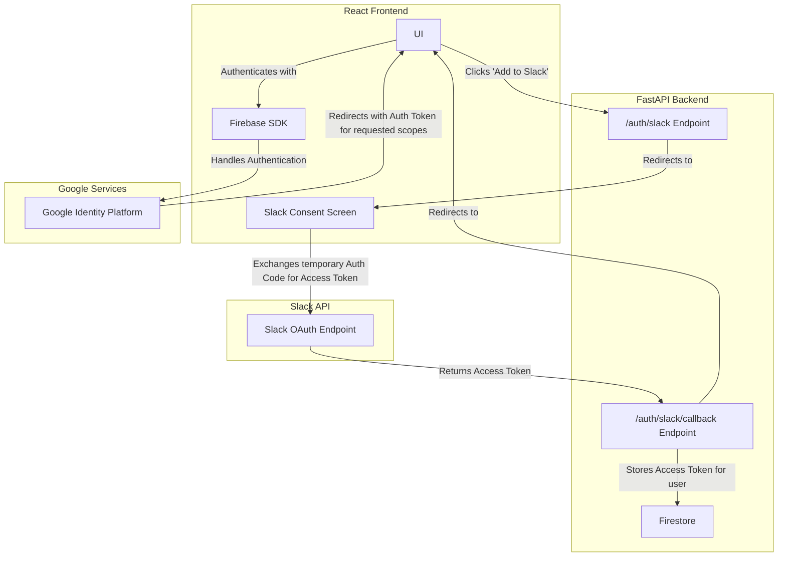
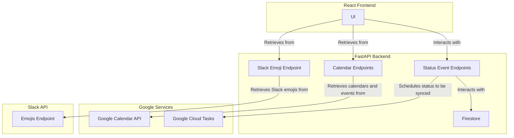
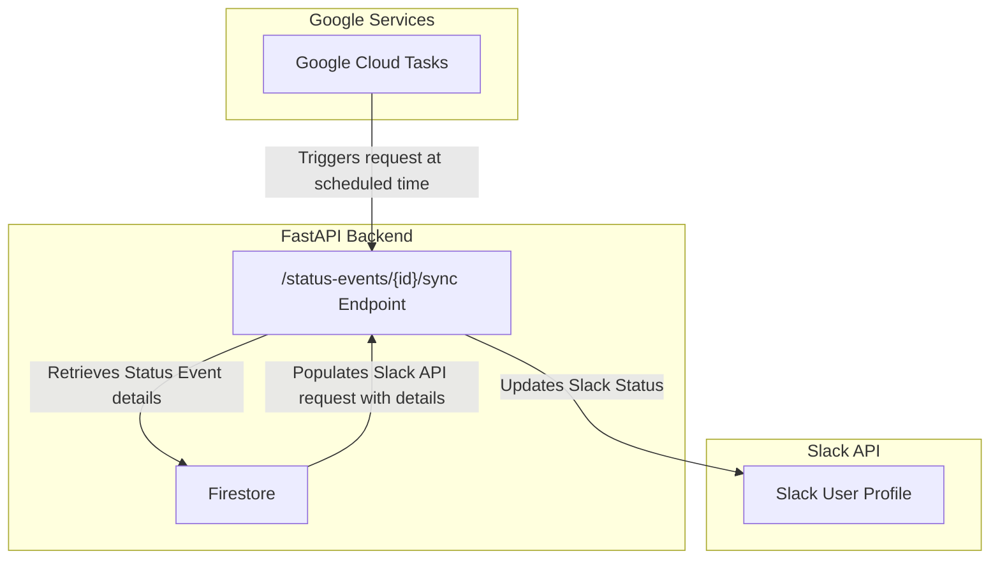

# Slack Status Syncer

Maximus Hayes


---

## Overview

Slack's [status feature](https://slack.com/help/articles/201864558-Set-your-Slack-status-and-availability) is a great way to keep users in your workspace informed about your availability, whether you're in a meeting, focusing on deep work, or away from your desk. However, it requires manual updates, with no built-in way to schedule statuses in advance.

[Slack Status Syncer](https://slack-status-syncer-801397650398.us-central1.run.app) solves this limitation by automatically updating your Slack status based on your Google Calendar events. Users can customize their Slack status for specific events, ensuring their status is accurately reflected in Slack while the event is happening, without manual intervention.

Slack Status Syncer provides full control over status updates, allowing users to personalize their messages and automate their workflow efficiently.

### [Try it out](https://slack-status-syncer-801397650398.us-central1.run.app)

Note - until this app is verified by Google, you may encounter a **Google hasn't verified this app** screen when signing in.

This is normal, and not blocking. You can continue to the application sign in by clicking

> Advanced > Go to slack-status-syncer.firebaseapp.com (unsafe) > Continue

---

## Project Layout

Below are useful directories and files to know about when navigating this codebase. 

```
/slack-status-sync
│── server/                 # FastAPI backend
│   ├── src/
│   │   ├── server.py       # Main FastAPI application with route handlers
│   │   ├── models.py       # Pydantic models for data validation and serialization
│   │   ├── database.py     # Firestore database interaction utilities
│   ├── Dockerfile          # for locally running Backend services
|
│── client/                 # React TypeScript frontend
│   ├── src/
│   │   ├── components/     # UI Components
│   │   ├── hooks/          # Custom React hooks for state management
│   │   ├── utils/          # Helper functions for API requests and interacting with external packages
│   ├── Dockerfile          # for locally running Frontend services
│
│── README.md               # Project documentation
```

## Architecture

This application is built with a FastAPI backend, a React TypeScript frontend, and integrates with multiple Google Cloud services and the Slack API.

[FastAPI Server Docs](https://slack-status-syncer-server-801397650398.us-central1.run.app/docs)

### Google Cloud Services

* **Cloud Build** - Automates CI/CD workflow for building and deploying the application

* **Artifact Registry** - Stores and manages container images for deployment

* **Cloud Run** - Provides a hosting environment for frontend and backend services

* **Firebase/Identity Platform** – Handles user authentication with Google OAuth

* **Cloud Firestore** – Object storage for managing user and status event records

* **Google Calendar API** – Retrieves user calendars and events from their connected Google account

* **Cloud Tasks** – Schedules and executes asynchronous API calls to update Slack status at the appropriate times

The following sections will provide overviews of important interactions, broken out from the application as a whole.

### Authentication (with Google and Slack)

Several layers of authentication are needed for the Status Syncer to access everything it needs to function. 

Authentication with Firebase and Google Identity Platform is used to sign users in with Google OAuth, and request access scopes to read user calendars and events from the Google Calendar API.

To update a user's Slack status asynchronously, a permanent access token is required. This ensures that scheduled updates can be performed without token expiration issues. Thus, a one-time 'Add to Slack' Authentication process does this, and stores user access tokens for future asynchronous calls.



### Populating the UI

Once a user is logged in, the UI is populated with data from their Google Calendars (via the Google Calendar API), and Status Events the user has created.

Google Calendars and events are dynamically fetched from Google Calendar API, so users always see up-to-date schedules without redundant Firestore storage

Status Events are fetched from Firestore, representing user-configured Slack statuses for specific calendar events.

Through the UI, users can create, edit, and delete Status Events to control their Slack presence.

When a new Status Event is created, a Google Cloud Task is scheduled at the event's start time. This task triggers an asynchronous request to update the user's Slack status automatically



### Updating Slack Status

Slack Statuses are updated asynchronously via scheduled **Google Cloud Tasks** requests to the backend's `/status-events/{id}/sync` endpoint. Each status event is assigned a unique ID upon creation, allowing it's details to be retrieved and processed at the scheduled time.

Relevant Status Event details include:
* Status text - Message displayed in the Slack status 
* Status emoji - *(optional)* Emoji accompanying the status
* Expiration time - **immutable** Unix timestamp of when the event ends

With these being populated in the Slack request just-in-time, users can modify their status text and emoji up until the event starts.



## Demo

https://github.com/user-attachments/assets/f99fd440-2614-44f8-87df-dded08f56740
